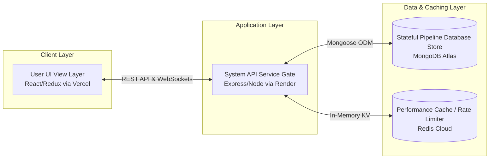
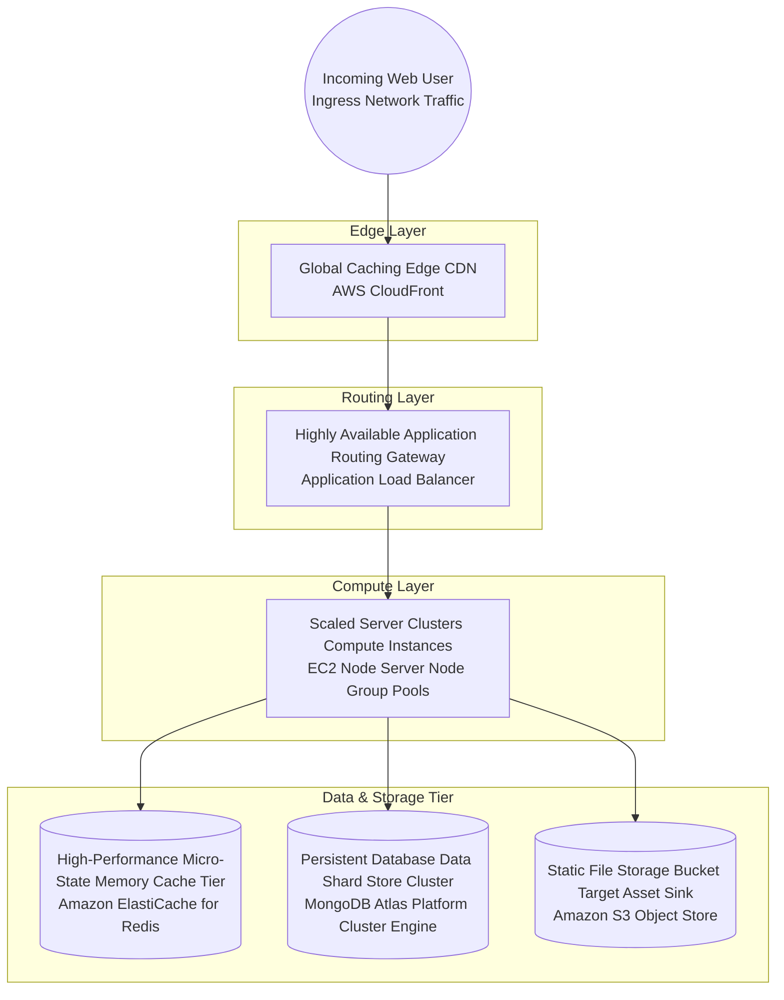

<div align="center">
  <h1>🚀 CommitFlow</h1>
  <p><em>A Developer Collaboration Platform unifying project velocity tracker tools, real-time workspace pipelines, and code repository insights inside a single interface.</em></p>

  <!-- Badges -->
  <p>
    
    
    
    
    
    
    
    
    
  </p>
</div>

---

## 📑 Table of Contents
- [High-Density Product Introduction](#high-density-product-introduction)
- [Core Capabilities](#core-capabilities)
- [Live Multi-Tier System Architecture](#live-multi-tier-system-architecture)
- [Production-Scale AWS Architecture Blueprint](#production-scale-aws-architecture-blueprint)
- [Unified Technology Components](#unified-technology-components)
- [Quick Start Local Setup](#quick-start-local-setup)
- [Multi-Container System Dockerization](#multi-container-system-dockerization)

---

## ⚡ High-Density Product Introduction

CommitFlow acts as a centralized command center for modern engineering software teams. It is designed to completely close the gap between asynchronous tasks, repository deployments, and organizational telemetry. By combining issue tracking, deployment logging, and peer reviews into a single, high-performance workspace, engineering leads can maintain absolute visibility over the entire product lifecycle without the overhead of context switching.

**Simple for developers — architecturally hardened underneath.**

---

## 🛡️ Core Capabilities

- **Granular Identity Gate & 2FA:** Multi-tier session isolation blocking unverified navigation entry vectors until a secure 6-digit SMTP OTP challenge passes.
- **Role-Based Workspace Matrix (RBAC):** Cryptographically isolated administrative control boundaries establishing structural permission levels for Admins, Editors, and Viewers.
- **Dynamic Kanban Board Engine:** Real-time state mapping for team milestones moving across sprint pipelines.
- **Deep GitHub Integration (MVP Specification):** Single-click repository overview linking tracking streams, pull request metrics, and live author commit feeds directly into project views.

---

## 🏗️ Live Multi-Tier System Architecture



---

## 🚀 Production-Scale AWS Architecture Blueprint



---

## 🛠️ Unified Technology Components

| Application Tier               | Primary Technology Stack                       | Description                                                                 |
| ------------------------------ | ---------------------------------------------- | --------------------------------------------------------------------------- |
| **Frontend Framework**         | React 18 & Vite                                | High-performance, reactive UI runtime for complex SPA dashboard components. |
| **State Management**           | Redux Toolkit (RTK)                            | Predictable, centralized state architecture handling asynchronous data flows.|
| **API Runtime Engine**         | Node.js & Express.js                           | Event-driven, non-blocking I/O model routing robust RESTful endpoint schemas.|
| **Primary Database**           | MongoDB Atlas & Mongoose                       | Document-oriented NoSQL storage persisting fluid, high-velocity JSON trees. |
| **Performance Cache Tier**     | Redis                                          | Key-Value memory store handling rate limiting, session mapping, and sockets.|
| **Real-Time Socket Gateway**   | Socket.io                                      | Bidirectional, event-based communication channels syncing Kanban states.    |
| **Container Isolation**        | Docker & Docker Compose                        | Isolated environment virtualization ensuring identical deployment blueprints. |
| **CSS Framework Styling Layer**| Tailwind CSS & Lucide React                    | Utility-first atomic styling engine bound to premium vector iconography.    |

---

## 💻 Quick Start Local Setup

Follow these exact steps to bootstrap the platform infrastructure locally on your machine.

**1. Clone the Repository Block**
```bash
git clone https://github.com/your-org/CommitFlow.git
cd CommitFlow
```

**2. Install Module Dependencies**
```bash
# Install backend dependencies
cd backend
npm install

# Install frontend dependencies
cd ../frontend
npm install
```

**3. Configure Environment Mapping**
Create a `.env` file in your `backend` directory mapping the necessary runtime variables:
```env
# Server Configuration
PORT=5000
NODE_ENV=development

# Database Clusters
MONGODB_URI=mongodb+srv://<username>:<password>@cluster0.mongodb.net/commitflow?retryWrites=true&w=majority
REDIS_URL=redis://localhost:6379

# Cryptographic Hash Secrets
JWT_SECRET=super_secret_jwt_hash_key_998877
JWT_EXPIRES_IN=7d

# Authentication Service
EMAIL_USER=your_service_account@gmail.com
EMAIL_APP_PASSWORD=your_secure_app_password

# External Integrations
GITHUB_CLIENT_ID=your_github_oauth_client_id
GITHUB_CLIENT_SECRET=your_github_oauth_client_secret
```

**4. Launch Development Compilers**
Run both processes concurrently (or in separate terminal tabs):

```bash
# Run backend API server
cd backend
npm run dev

# Run frontend UI server
cd frontend
npm run dev
```

---

## 🐳 Multi-Container System Dockerization

CommitFlow ships with complete containerization logic designed to isolate the database instances, memory caches, and server runtimes into predictable environments. 

To spin up the entire multi-container deployment architecture instantly:

```bash
# From the root directory containing the docker-compose.yml
docker-compose up --build
```
This single command pulls down the required isolated MongoDB/Redis images, builds your Node and React images, maps your internal ports, and attaches standard output streams directly to your terminal.
